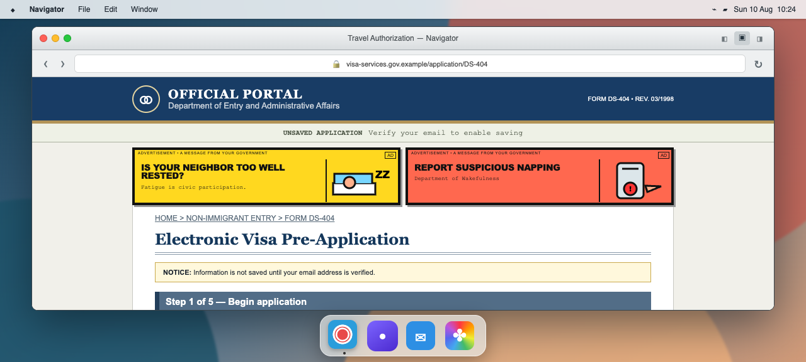

# FORM DS-404

**Your documents are in order. The website is not.** Race to complete a five-minute visa application inside a simulated desktop, digging through your password vault, inbox, and photo library while a hostile government portal disables paste, delays every page, serves animated propaganda, and quietly judges your moral character. Create an account before the session disappears, survive questions with only one defensible answer, and scrutinize the final PDF before one typo turns months of processing into an instant **DENIED**—a short bureaucratic horror-comedy about knowing exactly what to type and still being terrified to click Submit.

