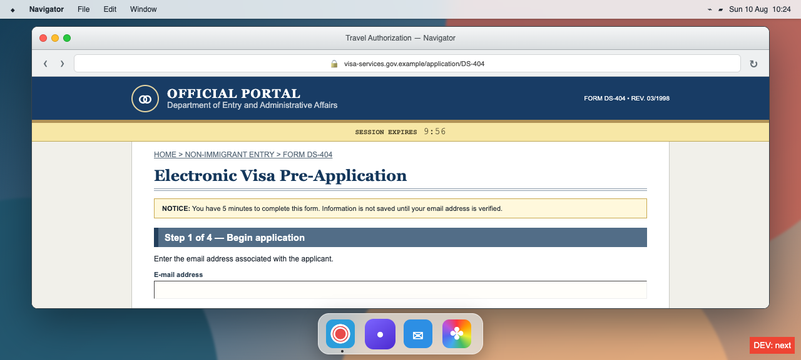

# Visa form

In this game the player will fill out a government form to apply for a visa. It's going to be a terrible form and a terrible website.

The basic look should be a simulated computer, with the form open in a browser within that computer. The computer has a few apps, notably 1Password with important info and a Photos app with a bunch of photos. These won't be real photos, just mock them up with SVGs. 1Password will be used to get the player character's contact card (name, DOB, address), passport info, surely some other stuff. I plan for the browser to only have the visa form, and any other info the player needs will be from other apps. The computer itself should have a slick and useful interface, since that's not the point of this game.

The form should be really bad. It should be slow, have input validation that triggers in weird ways. I especially want to have paste issues (like validation not running after paste, random fields not supporting pasting). It should definitely look old.

I want the experience to get progressively worse, so that the first interaction is okay and the task seems easy and then there are bugs, slowdowns, etc. The site should definitely have a 5-minute timeout, after which it loses your info (unless you've created an account - I guess this will require an email app to get a one-time code; don't have the player create a password).

## Prototype

**Back of the box:** You have five minutes, one passport, and the full might of an obsolete government website standing between you and a visa. Dig through a beautifully functional desktop for your personal records, verification mail, and passport photo—then race to retype them into a form that disables paste, rejects correct-looking dates, and gets slower with every click. The information is easy to find. Getting the website to accept it is the game.

Run with `bun install && bun run dev`, then open the local URL. Use the dock to open or switch between the visa form, Vault, Post, and Photos. Drag any floating window by its title bar; the three controls at the upper-right tile it left, return it to a large floating window, or tile it right. The red control closes it. Click any Vault value or the email code to copy it. The applicant photograph is `visa-photo.jpg`.

Verifying the emailed one-time code creates a saved account; the application then autosaves to this browser and resumes after a reload. Government marketing is enabled by default: animated public-service ads make navigation and scrolling slower until disabled through the Privacy page. The footer also contains the department's impressively unhelpful Accessibility statement.

For playtesting, add `?debug=true` to the URL to reveal a **DEBUG: fill current screen** button. It enters the correct values for the visible stage without advancing it.

