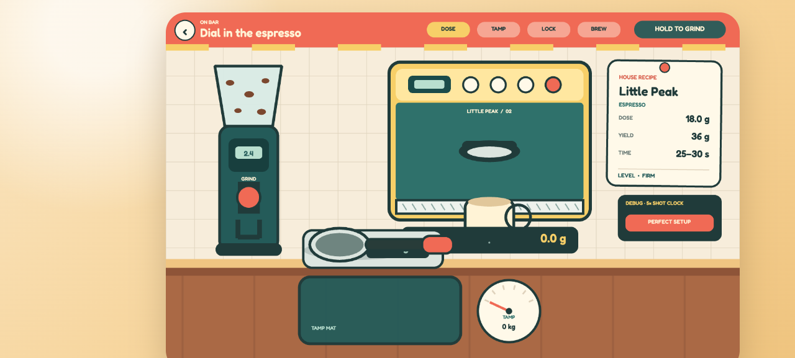

# Little Peak Coffee

Run a tiny specialty café as a meticulous mouse barista, where every gram and second makes it into the cup. Grind an exact 18 g dose, land a level tamp, lock in the portafilter, and stop the espresso at a perfect 1:2 ratio—then taste the result and discover that mastering technique is only the first link in a much bigger coffee supply chain.

