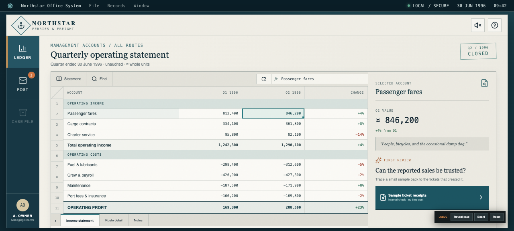
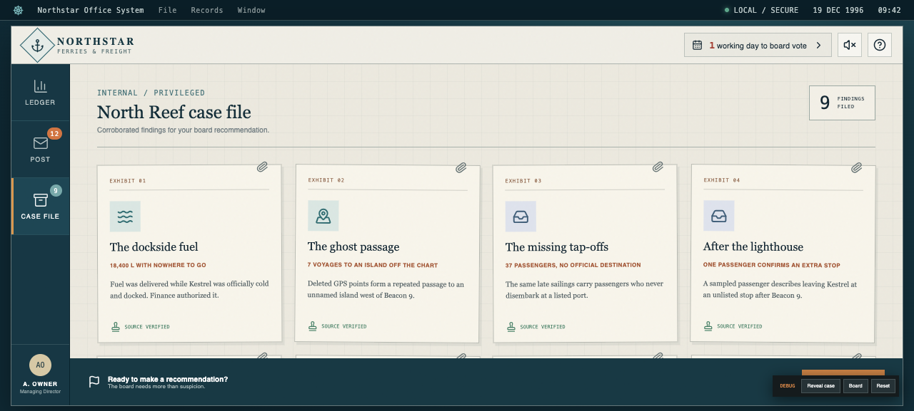

# Northstar Ledger

**The books balance. The boats don't.** You have six working days before the board shuts down an unprofitable ferry route. Interrogate the spreadsheet, choose which costly records to audit, and follow the replies from captains, clerks, and passengers toward an island that officially does not exist. Northstar Ledger is a five-minute accounting mystery where every cell is a question, every audit spends precious time, and the truth must survive the boardroom.

## Screenshots

