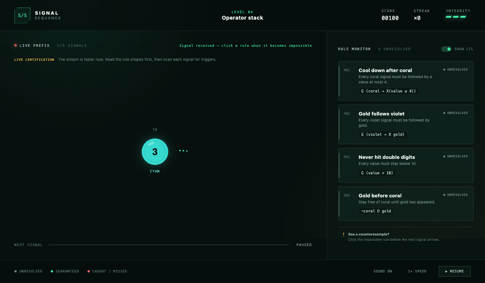

# Signal / Sequence

> **Back-of-the-box pitch:** Signals keep arriving and the rules keep stacking. In **Signal / Sequence**, you are the last line of defense in a live temporal-monitoring console: scan each colored, numbered pulse, hold several promises in your head, and strike the instant one becomes impossible. Flag too early and you damage the system; hesitate until the next signal and the violation slips through. Four escalating sequences turn the normally cerebral language of linear temporal logic into a tense, five-minute game of pattern recognition under pressure.

A small real-time game about monitoring finite prefixes against linear temporal logic rules. Rules use natural language by default, with optional notation for `G`, `F`, `X`, and `U`.

## Play

```bash
bun install
bun run dev
```

The game starts immediately. Click a rule when the observed sequence makes it impossible. An incorrect click or a missed deadline costs integrity.

## Verify

```bash
bun test
bun run build
```

## Programmatic playtesting

The browser exposes a deterministic test interface at `window.__SIGNAL_SEQUENCE__`:

```ts
const game = window.__SIGNAL_SEQUENCE__;
game?.pause(true);
game?.loadLevel(0);
game?.advance();
console.log(game?.getState());
game?.flag('safe-range');
game?.setSpeed(1.35);
game?.restart();
```

`getState()` returns the current prefix, true internal rule statuses, answers, lives, score, streak, and phase. `advance()` progresses one signal without waiting, making AI playtests deterministic.

## Screenshots




See [`GAME_DESIGN.md`](GAME_DESIGN.md) for the prototype’s interaction and logic decisions.
