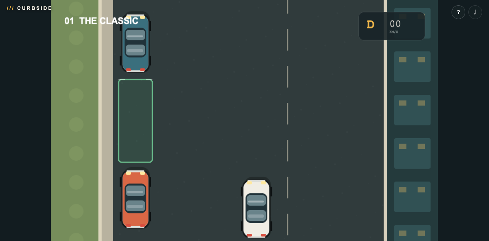

# CURBSIDE

**The curb is watching.** Slide a beautifully detailed little car into impossible-looking city gaps using real-feeling throttle, brake, steering, and gear controls. Three escalating micro-challenges turn the most ordinary driving maneuver into a tense dance of angles and inches—easy to understand, deeply satisfying to nail, and over before the meter runs out.

## Controls

Use the **?** button to switch control styles and view controls:

- **Driver:** throttle, brake, steering, and manual Drive/Reverse
- **Arcade:** arrow-key tank controls—up/down move, left/right turn
- **N:** skip to the next challenge

Touch controls are provided on coarse-pointer/mobile devices. Procedural music, engine rumble, reversing beeps, and collision sounds react to play.

For automated testing, use `?mute=1` and the `window.parkingGame` API (`getState`, `setInput`, `toggleGear`, `setPose`, `reset`, `next`).
