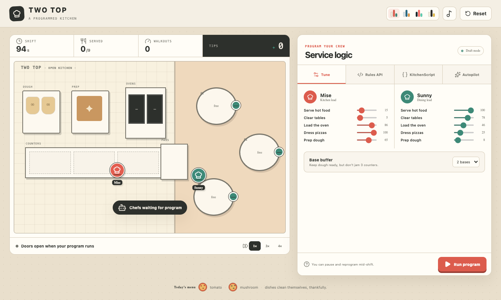
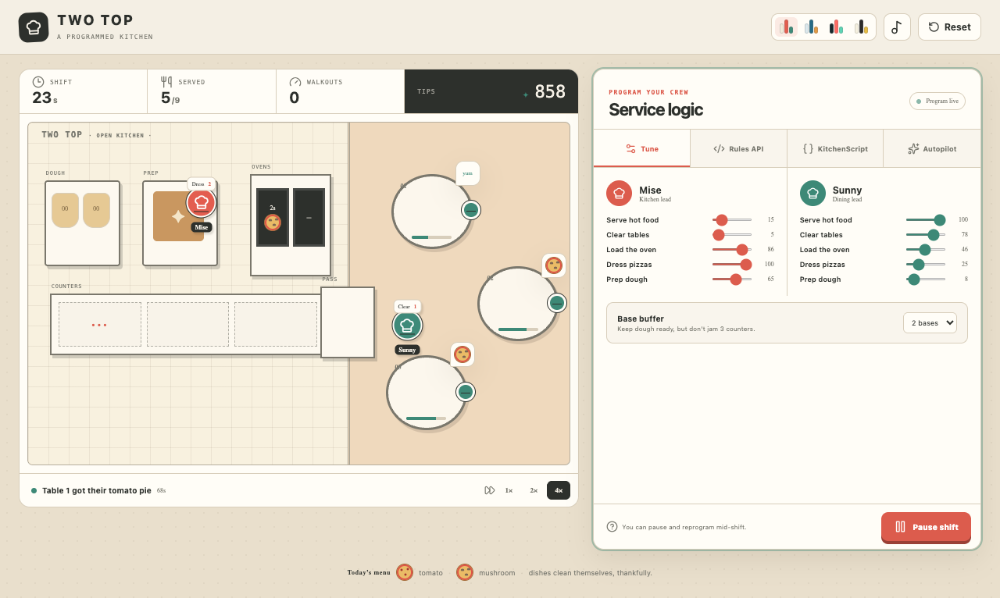

# Two Top

**The dinner rush is a debugger with mushrooms.** Program two tiny chefs, press Run, and watch your elegant plan collide with hot ovens, impatient tables, and three precious squares of counter space. Tune priorities or write compact kitchen rules, pause to patch your crew mid-service, and chase the perfect shift where every pizza lands hot and no guest walks out.

