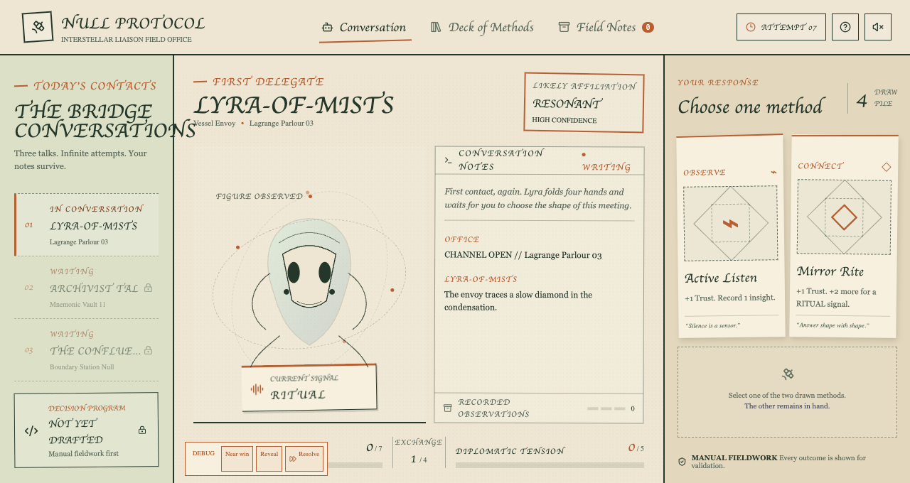
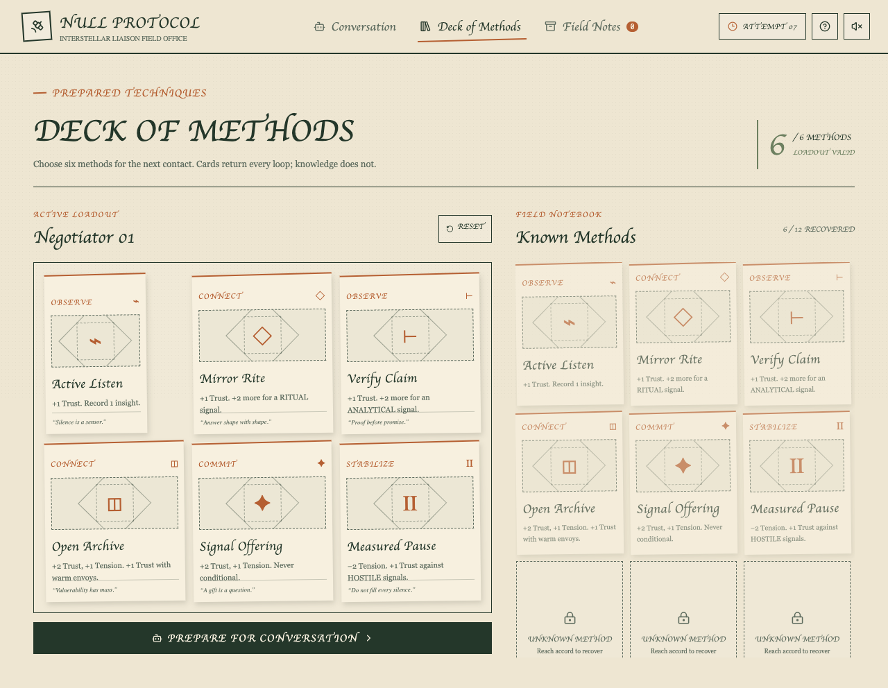

# NULL PROTOCOL

Humanity’s first contact keeps ending badly—so debug the conversation across time. **NULL PROTOCOL** is a compact programming puzzle where every alien gesture is a clue: study a fixed sequence of signals, arrange a six-step negotiation protocol, then choose between the two methods available at each exchange. Failed timelines reveal the shape of the solution; successful ones preserve new responses for harder contacts. Build trust without overloading the link, uncover the rival voices hidden inside the delegation, and find the precise procedure that can speak for Earth.

