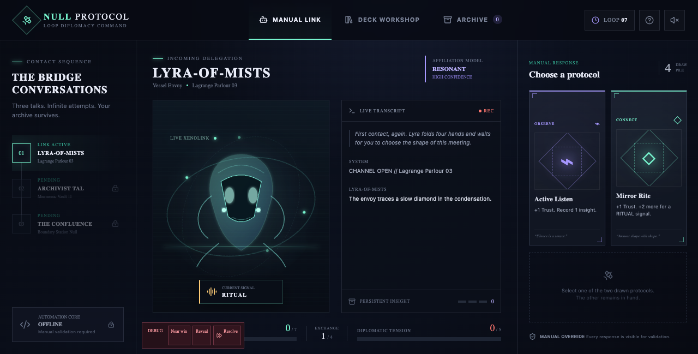
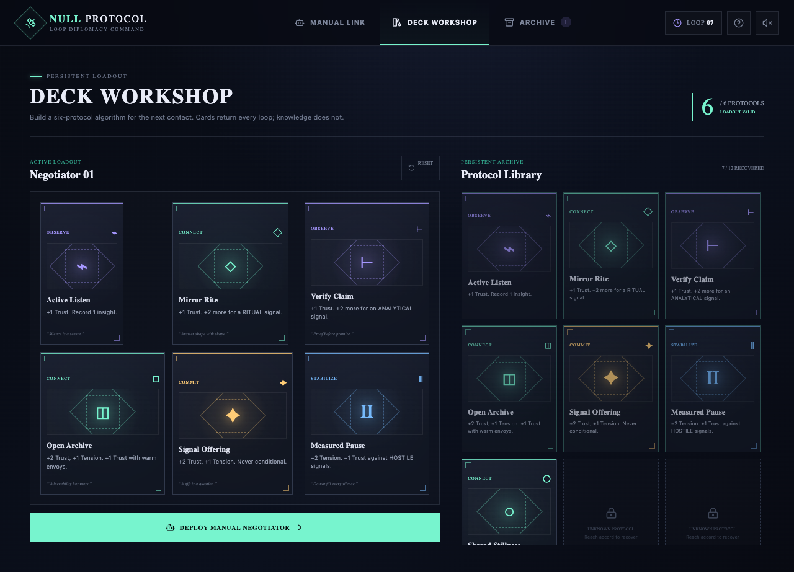

# NULL PROTOCOL

Humanity’s first contact keeps ending badly—so send the conversation back through time. **NULL PROTOCOL** is a compact diplomacy deckbuilder where every alien gesture is a clue: read the signal, choose one of two protocol cards, and build trust before tension fractures the link. Observe envoys to uncover the two rival factions hidden inside their delegation, recover powerful responses from successful timelines, and rebuild a six-card negotiating deck for the next impossible conversation. Today you drive the robot by hand; tomorrow, you’ll write the algorithm that speaks for Earth.

