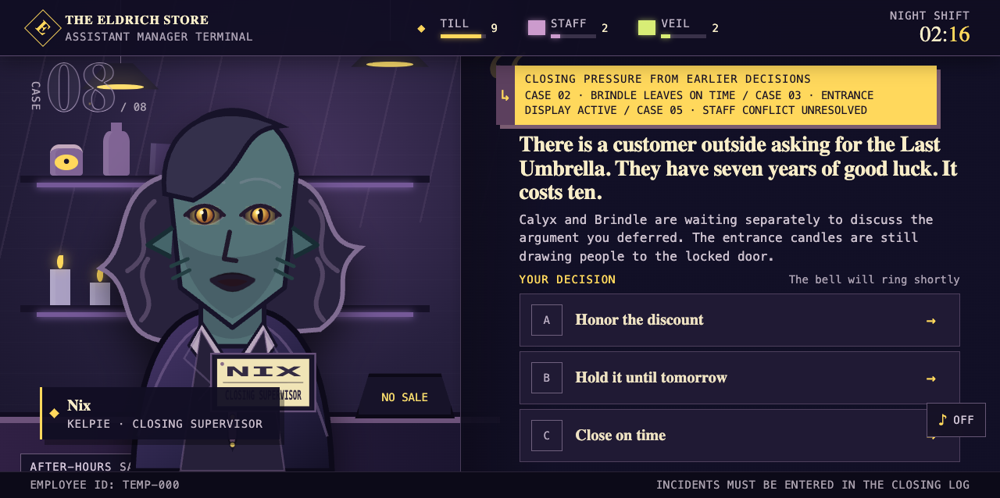
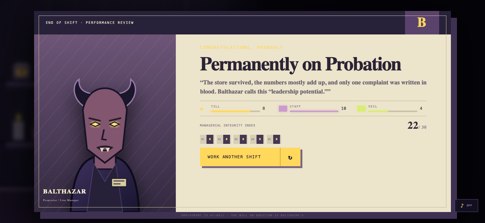

# The Eldrich Store

The night market was not here yesterday, but its help-wanted sign is lit. In **The Eldrich Store**, Balthazar hires you for one night as assistant manager, where returns, break coverage, damaged equipment, staff disputes, deliveries, and closing time all require your attention. The staff are dependable mythical creatures and the merchandise has unusual terms of sale, but consequences are painfully ordinary: neglect an argument and it erupts during a rush; repair a trolley and it earns its keep; improvise a refund and customers remember. Make eight practical decisions without seeing the numbers behind them, then face Balthazar’s end-of-shift review.

