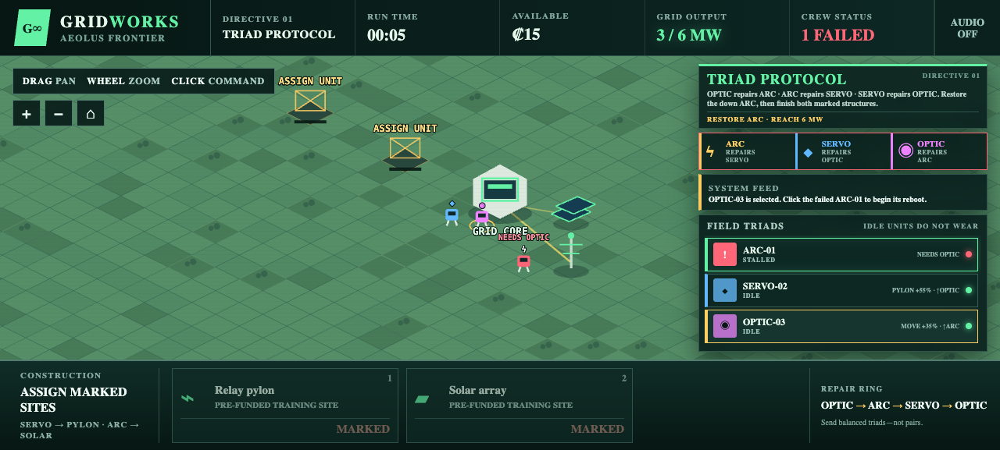
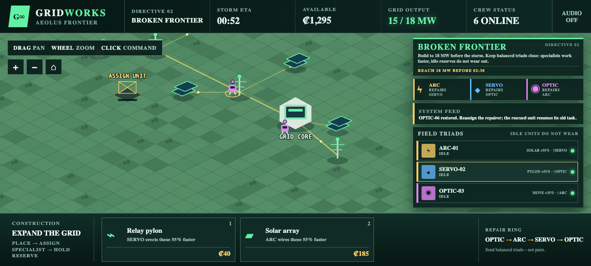

# GRIDWORKS

**A pair always leaves someone stranded.** Command ARC, SERVO, and OPTIC robots whose repair skills form a one-way ring: each can save one type and must depend on another. Split balanced triads to race specialists toward pylons and solar arrays, hold fast responders in reserve, and improvise when a single failure turns your perfect plan into a cascading rescue. Learn the protocol in a focused tutorial, then build an 18 MW frontier grid before the storm arrives.

