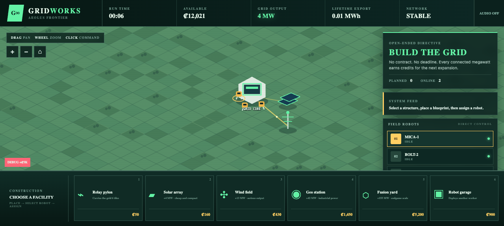
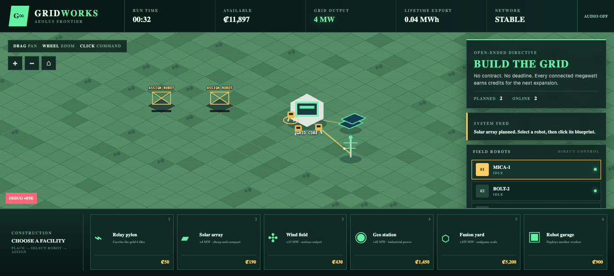

# GRIDWORKS

**The frontier is open. How far can your grid reach?** Command a twitchy crew of construction robots across a vast isometric landscape, string relay pylons back to your Grid Core, and turn isolated solar, wind, geothermal, and fusion facilities into one enormous power network. Every connected megawatt funds the next expansion—but blueprints build nothing by themselves, machines lose their task lock, and every idle robot is growth left on the table. There is no deadline and no final contract: just one more line, one more facility, and a power empire spreading toward the horizon.

