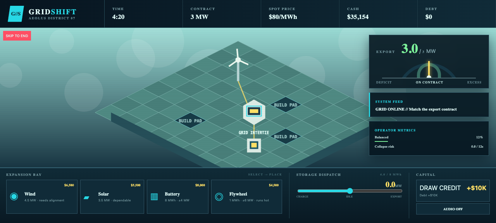

# GRID//SHIFT

**The contract is climbing. Keep the grid alive.** Build a clean-energy operation across a bright isometric frontier, then meet white-knuckle demand spikes by actively dispatching stored power and recalibrating unreliable equipment. Expand carefully, borrow only when you choose, and keep your export needle in the green—every megawatt counts.

