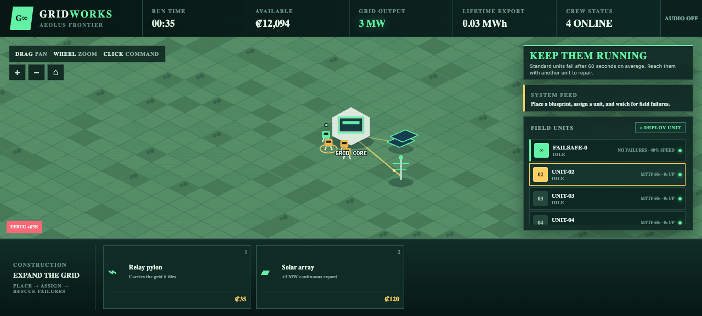
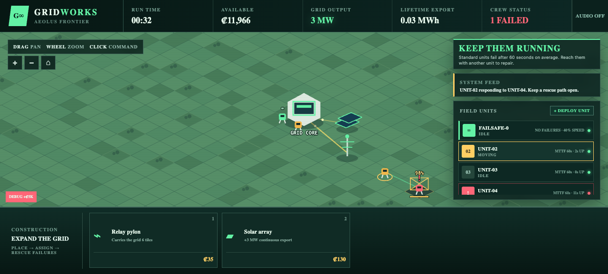

# GRIDWORKS

**How many unreliable robots can you keep running at once?** Expand a frontier solar grid with a crew of fast, failure-prone construction units that break down after only 60 seconds of work on average. Every new unit accelerates construction—and adds another machine you may have to rescue when it collapses in the field. Divert working robots from valuable projects, chain together desperate repairs, and keep the perfectly reliable but painfully slow FAILSAFE-0 ready for the breakdown that would otherwise stop everything.

