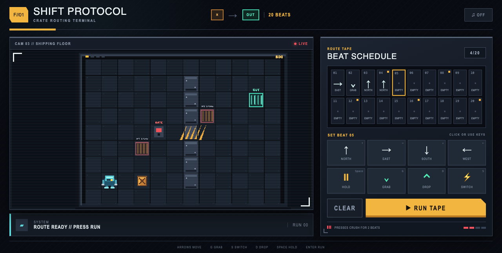

# Shift Protocol

The factory never stops—and neither does the beat. Build a 20-beat command tape that guides a tiny cargo robot through crushing presses, a locked blast door, and one razor-tight delivery window. Every failed run reveals exactly where your timing broke, turning trial, error, and tiny schedule edits into the thrill of finally watching a perfect route click into place.

