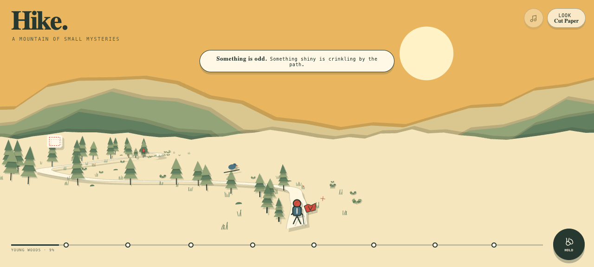
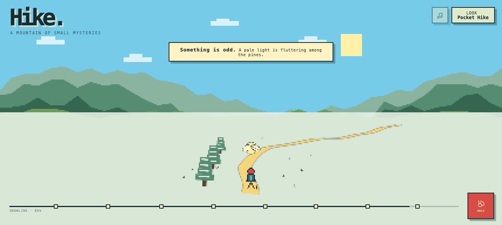

# Hike

**A mountain of small mysteries.** Follow a ribbon of switchbacks from knee-high saplings through towering old growth, drifting mountain fog, and finally the snowline. The trail is alive with ordinary trees, brush, wildflowers, rocks, and grass—until two trees match exactly, a cloud forgets what shape it should be, and the stones begin to sing. Hold to hike, watch each bend unfold, and log eight unmissable curiosities in warm cut paper or bright pocket-sized pixel art.

