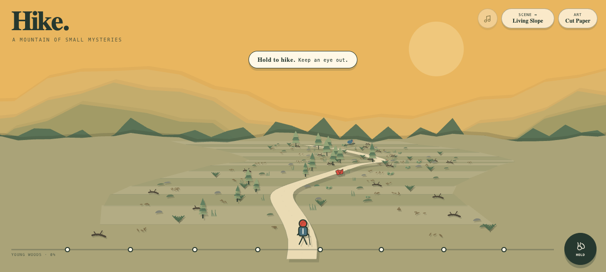
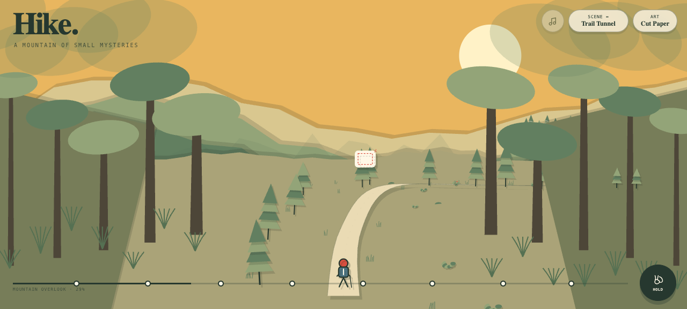

# Hike

**Take the long way up.** Follow a climbing ribbon of switchbacks through moss, deadfall, ferns, old growth, drifting mountain fog, and finally the snowline. The woods keep the next bend close until the trees suddenly fall away into a mountain overlook—then close around you again. Hold to hike through a warm cut-paper landscape or a bright pocket-sized pixel world.

