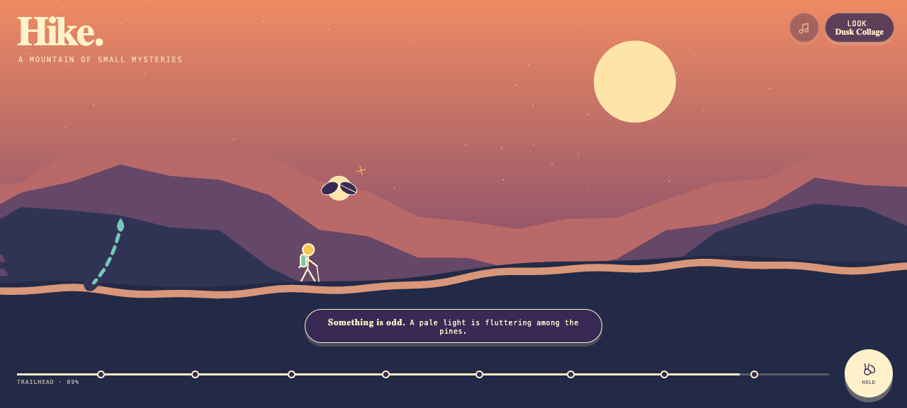

# Hike

**A mountain of small mysteries.** Take a quiet, paper-cut walk up a winding trail where the trees are all different—until two are not, a cloud forgets what shape it should be, and the stones begin to sing. Hold to hike, stop when the landscape feels wrong, and click each curious thing to add its strange little story to your trail log. Eight unmissable surprises and four switchable art treatments turn one short climb into a pocket-sized expedition worth looking at twice.

