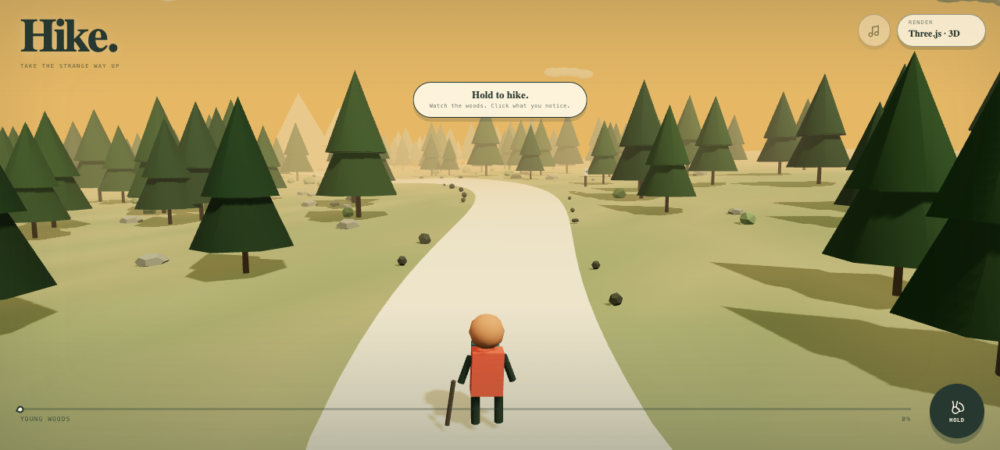
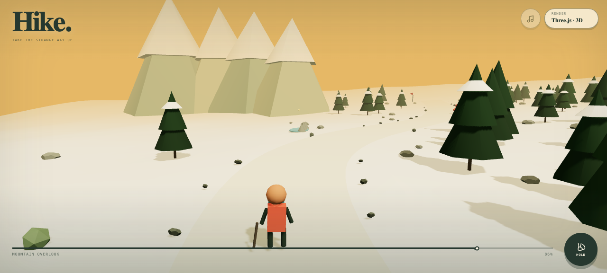

# Hike

**Take the strange way up.** Follow five minutes of climbing switchbacks through a tiny low-poly wilderness, where the pines cast long shadows, fog settles into the trail, and occasional breaks reveal the faceted range beyond. There is always something new around the next bend—sometimes a deer, cairn, or alpine tarn, sometimes a square cloud, an uphill waterfall, or a warm cup of tea set for nobody. Look for a glint between the trees, log what you find, and keep climbing from the gold-lit young woods to the snowline.

