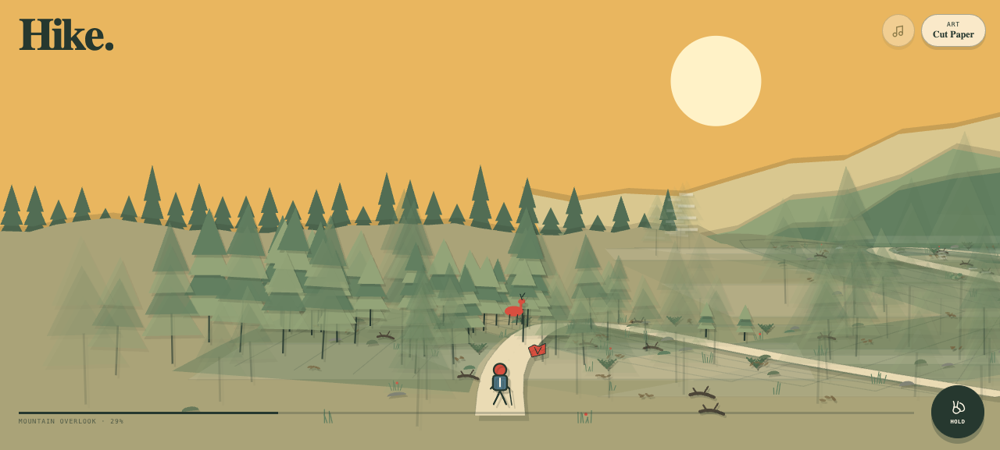

# Hike

**Take the strange way up.** Follow five minutes of climbing switchbacks beneath a dense mountainside forest, with the slope close on your left and occasional cliffside breaks opening to the range on your right. There is always something new around the next bend—sometimes a deer, cairn, or alpine tarn, sometimes a square cloud, an uphill waterfall, or a warm cup of tea set for nobody. Look closely, log what you find, and keep hiking through a warm cut-paper landscape or a bright pocket-sized pixel world.

