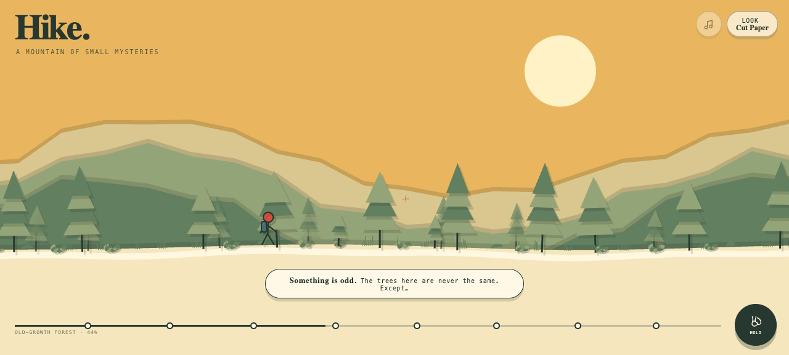
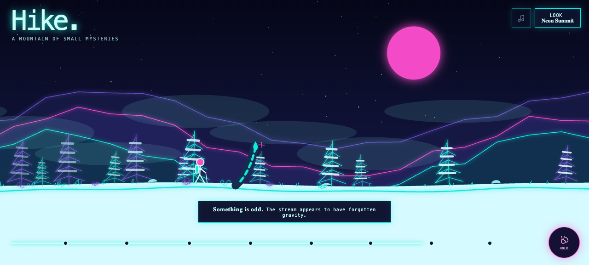

# Hike

**A mountain of small mysteries.** Take a quiet climb from knee-high saplings through towering old growth, drifting mountain fog, and finally the snowline. The trail is alive with ordinary trees, brush, wildflowers, rocks, and grass—until two trees match exactly, a cloud forgets what shape it should be, and the stones begin to sing. Hold to hike, stop when the landscape feels wrong, and log eight unmissable curiosities, all rendered in your choice of cut paper, ink wash, neon wireframe, or bright pixel art.

