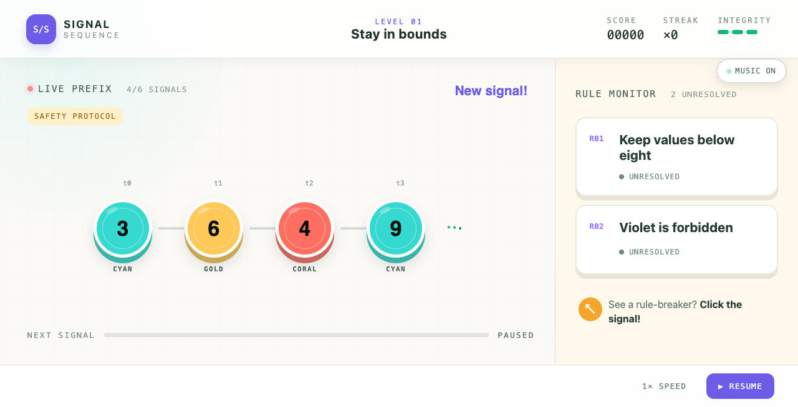
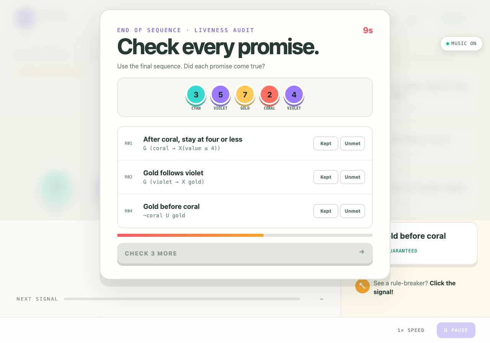

# SIGNAL / SEQUENCE

**Monitor the signal.** You are the last line of defense in a _live_ temporal-monitoring console: scan each pulse, hold several promises in your head, and strike the instant something is _unsafe_. Flag too early and you damage the system; hesitate until the next signal and the violation slips through. Four escalating sequences. Eventually the temporal logic gets pretty complicated.

