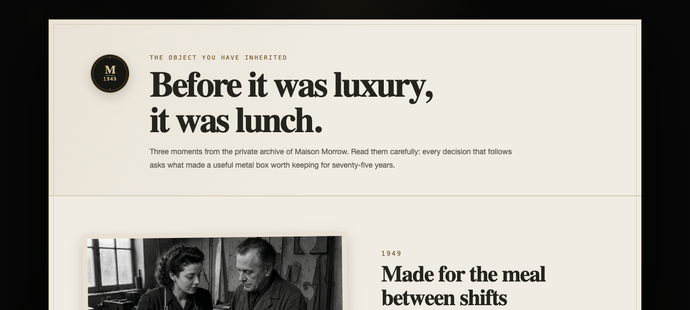

# Maison Morrow

You inherit a 75-year-old maker of extraordinary lunchboxes—and a public that has begun to doubt its legend. Learn how a metal box built for shift meals became an accidental icon, then face twelve tense decisions about food safety, scarce enamel, famous owners, schools, repairs, and the dangerous temptation to put a Morrow everywhere. Every sealed choice becomes tomorrow’s little news story. Can you keep the object useful enough to scar, good enough to repair, and rare for the right reasons—or will Morrow become just another lunchbox?

