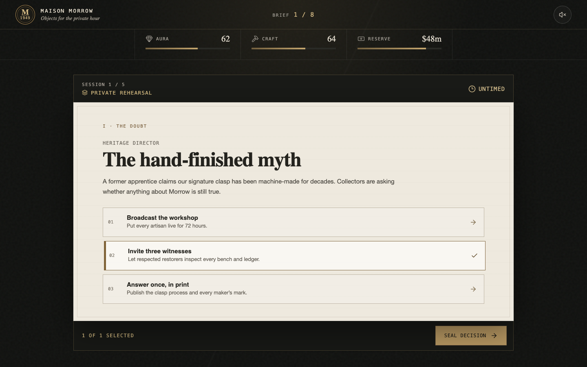
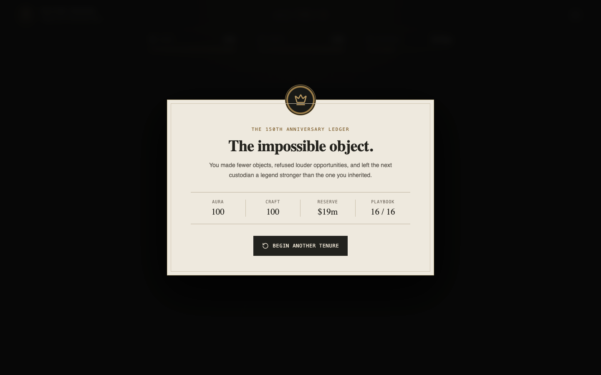

# Maison Morrow

You inherit a 75-year-old maker of luxury lunchboxes with a healthy reserve—and a public that has begun to doubt its legend. Across eight tense quarters, say no to easy validation, protect the impossible object, and learn why attention is cheap but access is not. Every choice pays now and reveals its true cost later—while each surge of market noise begs you to chase millions of perfectly irrelevant units. Can you restore faith and leave behind a stronger maison, or will Morrow become just another lunchbox?

