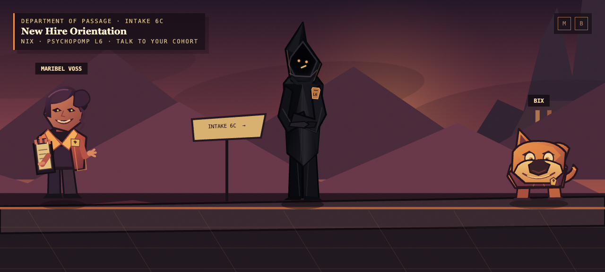

# Psychopomps (art demo)

You trained for centuries to shepherd the dead. Now survive your first day in the afterlife’s least prepared department. **Psychopomps** is a dryly comic action-RPG about Nix, an impossibly senior new hire navigating a new job. This is just an art demo, there's no game here.

## Prototype art direction

A geometric, mid-century comic-book hell: layered paper-cut silhouettes, smoky plum shadows, scorched coral light, and small flashes of bureaucratic manila. Nix is a near-black pointed figure whose tiny amber mask and badge are the only interruptions; other characters are warmer, rounder, and much more animated.

## Controls

Walk with **A/D** or **←/→**. Press **E**, **Enter**, or **Space** near a character to talk. Dialogue deliberately offers one response at a time in this scene.

## Screenshot

