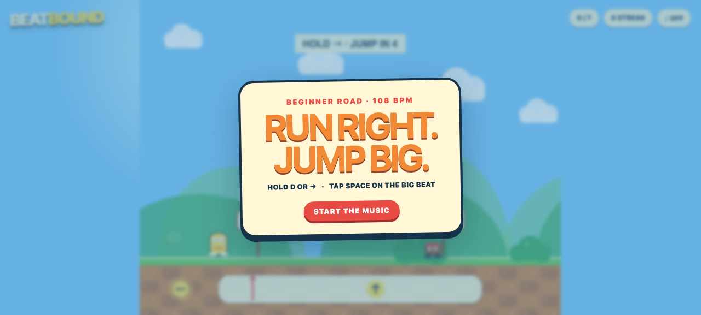

# Beatbound

**Run right. Jump big.** Beatbound turns a bright, toy-box platforming road into a rhythm you can see: hold right through a few comfortable beats, listen for the musical warning, then vault a tiny bouncer exactly when the jump cue hits the marker. Seven forgiving jumps, one simple action, and a chunky procedural groove make this a welcoming first run—while perfect timing still builds a satisfying streak all the way to the flag.

