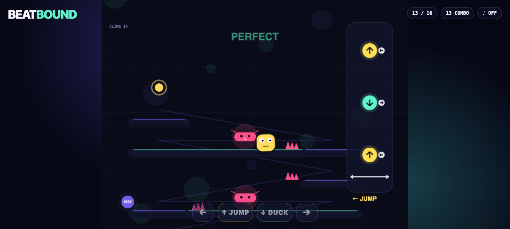

# Beatbound

**The route is the rhythm.** Personally steer a tiny wide-eyed beat runner left and right up a neon obstacle tower, using the heavy procedural bassline to time every leap. Each downbeat is a decision—jump the collidable spikes, hold low under an incoming flyer, and still stick the next ledge—and every mistimed move breaks the run. Read the Just Dance-style cue lane, trust the bass, and chain all 16 hands-on crossings into one perfect, pulse-pounding climb.

