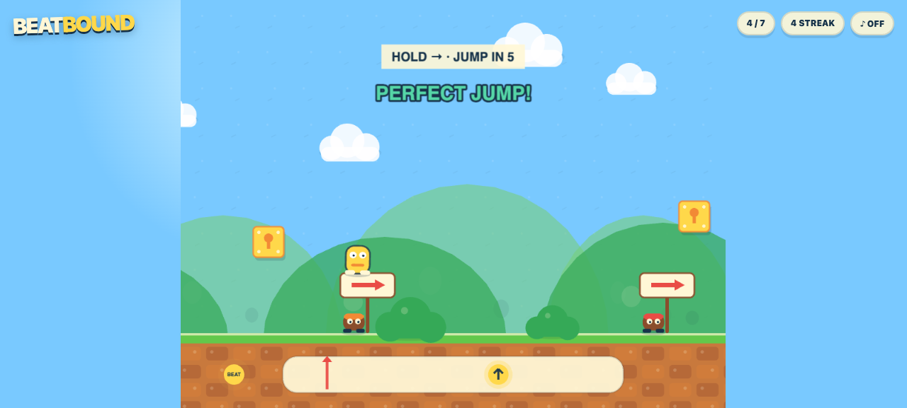
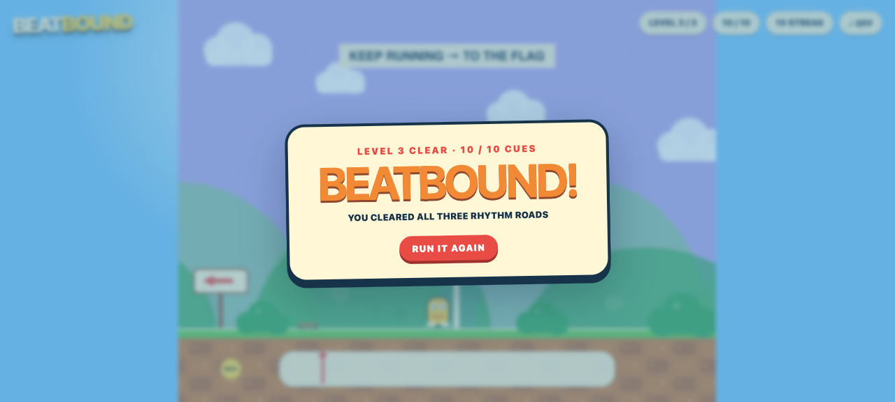

# Beatbound

**Run right. Jump big. Then keep up.** Beatbound turns three bright, toy-box platforming roads into rhythms you can see. Learn the groove with seven generous jumps, add low-flying duck cues as the pattern quickens, then read both action and direction through the final switchback sprint. Tiny bouncers, musical warnings, and a chunky procedural soundtrack make every move readable—while a perfect three-level streak still takes focus all the way to the flag.

