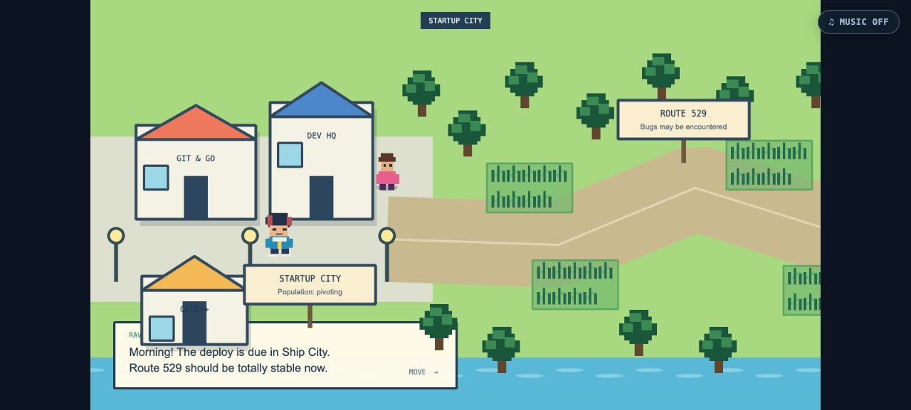
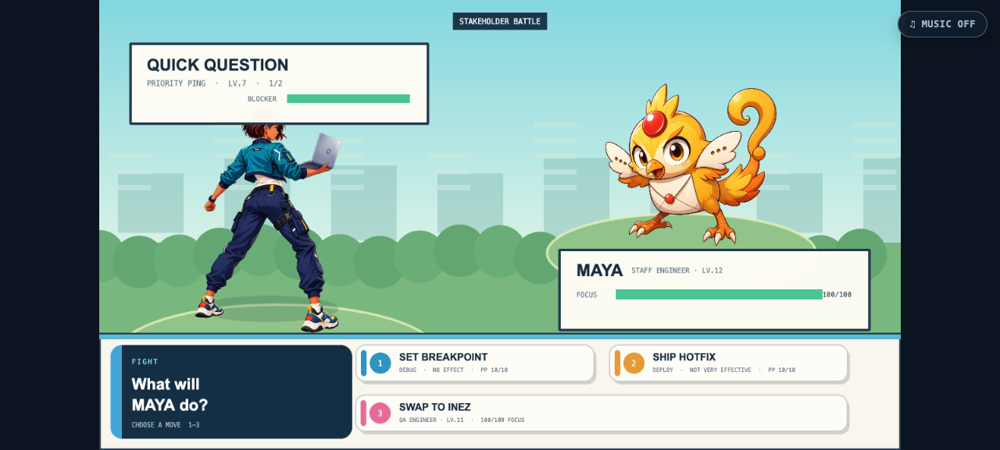

# Route 529

The deploy is due in Ship City, but Route 529 is crawling with wild bugs, runaway memory leaks, and one product manager whose “tiny change” has grown three extra acceptance criteria. Lead a party of engineers through a bright, tongue-in-cheek RPG sprint where breakpoints, tests, metrics, and risky hotfixes are your battle moves—then ship before everyone’s focus hits zero.

