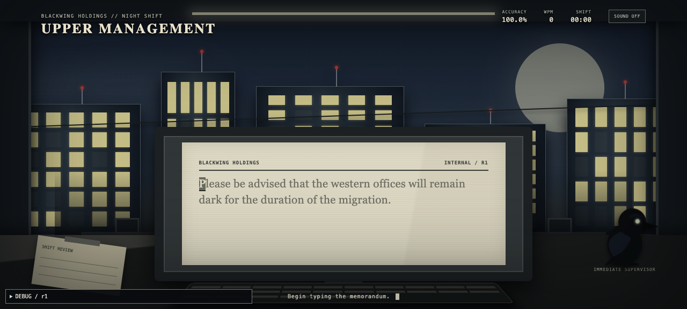
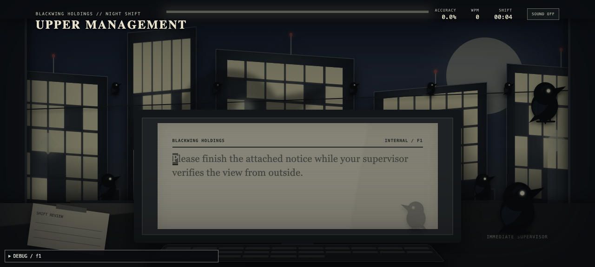

# Upper Management

> **Type carefully. Upper Management is watching.**

You are the only human still working the night shift, and your raven supervisor has another stack of memos to dictate. Type each dry corporate notice with care as its language quietly remakes the office outside your monitor: shadows resign from their owners, visitors arrive at the windows, and every empty desk receives a new manager. Your mistakes are not merely counted—they are studied, rehearsed, and returned to you while an increasingly crowded skyline watches. Finish the shift and discover exactly what promotion has been approved.

**A five-minute adaptive accuracy game about corporate policy, impossible architecture, and ravens.**

## Screenshots

